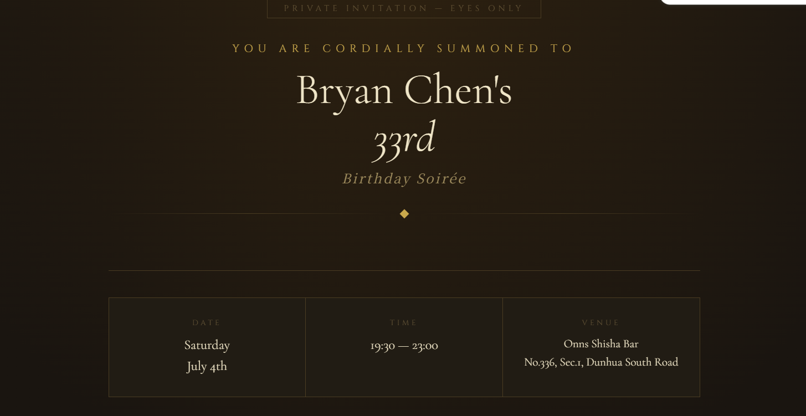
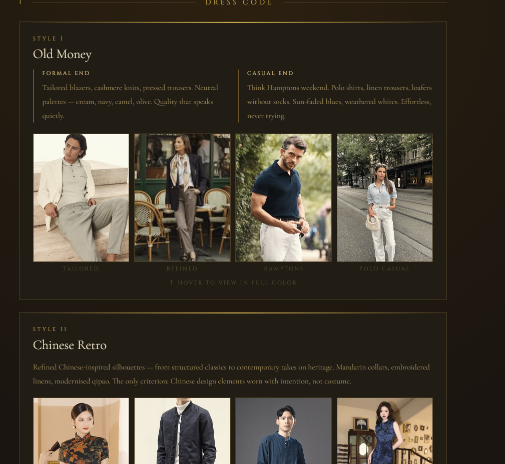
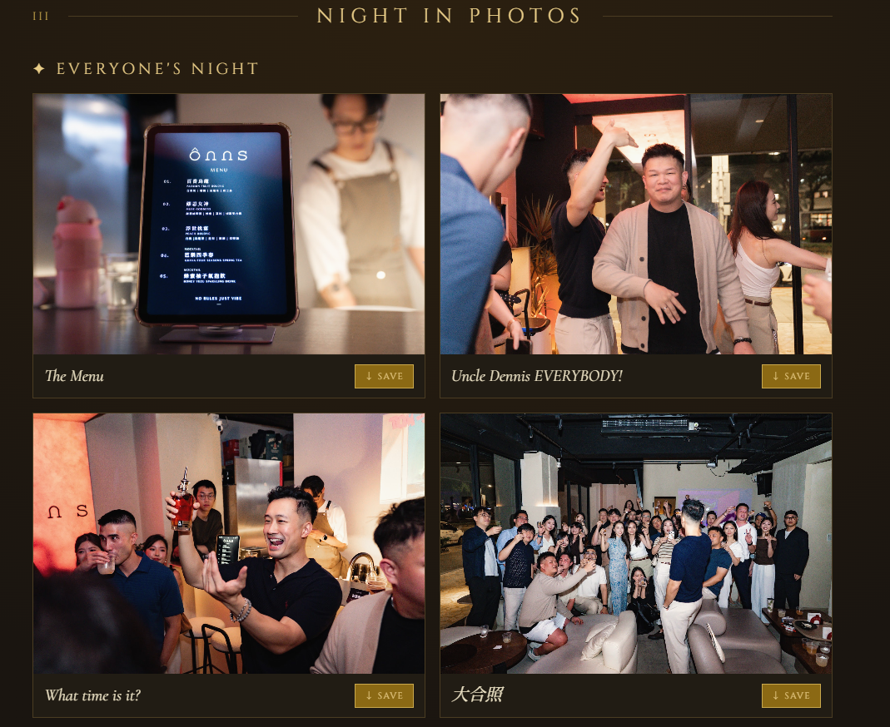

# 🕵️ Classified Dossier — Bryan's 33rd Birthday Invitation

A bilingual (English / Mandarin), single-page invitation site built for a spy-themed 33rd birthday celebration at Onns Shisha Bar, Taipei. Guests unlock a personalized "dossier" with a private access code to reveal party details, dress code guidance, and a photo gallery.

**🔗 Live site:** https://birthday-2026-production-98cb.up.railway.app/

Built solo, with [Claude](https://claude.com) as a pair-programming partner — designed, developed, and shipped end-to-end by Bryan Chen.

## Screenshots

**Invitation**


**Dress Code**


**Photo Gallery**


## Try It Yourself

The site is gated behind a personal access code system. To see it in action, visit the live site and enter:

```
lordmbaku
```

This unlocks a sample dossier so you can explore the reveal flow without needing an actual invite.

## Features

- **Bilingual UI** — full English / Traditional Chinese toggle via conditional `.en-only` / `.zh-only` rendering
- **Personal Access Codes** — password-gated reveal system; each guest's code unlocks their own "assignment" (bodyguard role, target clue) for a spy-themed party game
- **Dress code guide** — two curated aesthetics (Old Money and Chinese Retro) with reference imagery and styling notes
- **Photo gallery** — public and private sections, individual and batch ("Download All") download buttons, Google Drive–hosted images
- **Custom editorial design** — parchment/gold color palette, serif typography (Cormorant Garamond, Cinzel, Noto Serif TC), ornamental CSS borders and watermarks for a "classified dossier" aesthetic

## Tech Stack

- **Vanilla HTML / CSS / JavaScript** — no frameworks or build step
- CSS custom properties for theming, CSS Grid for layout, hover-based image transitions
- Google Fonts (Cormorant Garamond, Cinzel, Noto Serif TC)
- Google Drive for photo hosting/downloads
- **Deployment:** [Railway](https://railway.app/) — static site, deploys straight from this repo

## Project Structure

```
birthday-2026/
├── index.html          # entire site: markup, embedded <style>, and <script>
└── screenshots/         # README preview images
```

A single self-contained HTML file — no dependencies to install, no build process. Open `index.html` directly in a browser, or deploy as a static site.

## Running Locally

```bash
git clone https://github.com/bryan9132-lab/birthday-2026.git
cd birthday-2026
open index.html   # or just double-click it
```

## Deployment

Deployed on Railway as a static site, auto-building from the repo's `main` branch.

## About

Built as a one-off personal project for a real event — a lightweight example of a fully custom, animation-light, editorial-style invitation site with a gated-content pattern (access codes) and a bilingual content system.

---
Made with care for a July 2026 celebration in Taipei. 🥂
